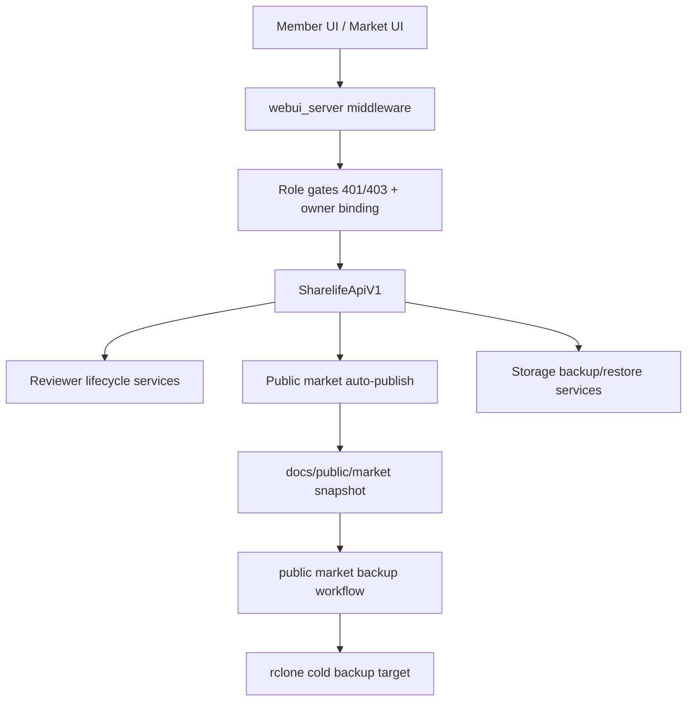

# Execution Direction Gap-Closure (v1.2)

## Problem Frame
Current delivery is no longer blocked by missing core features. The gap is now between:
- what the roadmap says should be hard guarantees, and
- what the running architecture can reliably guarantee under long-term iteration pressure.

Evidence-based baseline from current code:
- Authorization semantics are mostly deterministic and test-covered (`401` unauthenticated, `403` denied) in WebUI API middleware and endpoint adapters.
- Admin -> reviewer lifecycle has reached a functional closed loop (invite, redeem, device register/list/revoke/reset, token/session checks, audit trace).
- Public market publish and backup pipelines exist end-to-end, with sanitization boundaries and CI workflows.
- The frontend orchestration layer remains concentrated in large runtime files (`sharelife/webui/app.js`, `sharelife/webui/market_page.js`), creating coupling and slowing safe UI iteration.

## Requirements

**Authorization Correctness and Boundary Integrity**
- R1. Keep owner-aware authorization strict for upload and uploaded-resource management paths (template/profile-pack submit + member-owned submission detail/download surfaces).
- R2. Keep reviewer sessions device-granular: allow multi-device coexistence, revoke by device, and support admin global reset of reviewer devices/sessions.
- R3. Keep admin/reviewer auth fail-closed: invalid configured credentials must never degrade the system into permissive/no-auth behavior.

**Frontend Architecture and UX Stability**
- R4. Decompose WebUI orchestration into bounded modules so member, market, reviewer, admin, and shared auth/i18n logic can evolve independently without cross-breakage.
- R5. Normalize visual tokens (button, text, panel, emphasis) so readability and interaction consistency do not regress under theme/locale changes.
- R6. Keep `/member` and `/market` workflow parity for install/upload/submit options and member-owned management surfaces.

**Market Distribution and Backup Reliability**
- R7. Keep approved profile-pack -> public market publication automated and auditable, with sanitized-only publishing guards.
- R8. Keep public market backup scheduled and verifiable with artifact+manifest checksum traces.
- R9. Keep strict public/private boundary: only sanitized market artifacts are downloadable publicly; auth secrets and private ops materials remain private.

**Storage Cold-Backup Correctness**
- R10. Enforce remote encryption gate when remote sync is enabled; non-compliant remote sync must fail predictably.
- R11. Keep retention behavior effective (local snapshot pruning + remote retention execution), not policy-only.
- R12. Keep restore lifecycle deterministic (`prepare -> commit|cancel`) with persisted validation evidence.

**Docs and Contract Synchronization**
- R13. Keep public docs interface-focused and private docs SOP-focused, with CI guardrails against private-surface leakage.
- R14. Keep tri-lingual docs and API/auth badge surfaces aligned with actual route/method/error behavior.

## Progress vs Requirements (Evidence Matrix)

| Requirement | Status | Evidence (Code/Test/Docs) | Gap / Risk |
| --- | --- | --- | --- |
| R1 | Completed (scoped) | `sharelife/interfaces/webui_server.py` (`_request_member_user_id`), `tests/interfaces/test_webui_server.py` owner-scope cases, `tests/interfaces/test_web_api_v1.py` owner-scoped submission tests | Scope is intentionally limited to upload/uploaded-resource management; non-upload endpoints may still accept cross-user targets when authenticated member mode is used. |
| R2 | Completed | `sharelife/interfaces/webui_server.py` (`_session_key`, `_issue_token`, reviewer device revoke/reset paths), `sharelife/application/services_reviewer_auth.py`, reviewer auth flow tests in `tests/interfaces/test_webui_server.py` | Reviewer device key material is state-store plaintext today (acceptable for local fallback, but not ideal for stronger threat models). |
| R3 | Completed | Admin password normalization in `sharelife/interfaces/webui_server.py` (`min_length=12`), invalid role fail-closed path, `tests/interfaces/test_webui_server.py` invalid admin password tests | Auth relies on runtime secret distribution quality (ops discipline still required). |
| R4 | Partial (advancing) | Shared runtime helpers (`sharelife/webui/runtime_helpers.js`), market filter helpers (`sharelife/webui/market_filters.js`), facet view helper (`sharelife/webui/market_facet_view.js`), event-binding helper (`sharelife/webui/market_event_bindings.js`), status/evidence helper (`sharelife/webui/market_status_view.js`), auth/link-visibility helper (`sharelife/webui/market_auth_view.js`), catalog ranking helper (`sharelife/webui/market_catalog_insights.js`), catalog card/insight view-model helper (`sharelife/webui/market_catalog_view.js`), and compare text/detail helper (`sharelife/webui/market_compare_helpers.js`) now back `market_page.js`; coverage in dedicated webui tests and meta wiring tests | Primary orchestration files are still large (`sharelife/webui/app.js`, `sharelife/webui/market_page.js`), so further extraction remains needed for lower coupling. |
| R5 | Partial | Shared tokens in `sharelife/webui/style.css`, multiple UI iterations landed | No contrast/readability automated guard; regressions still possible in specific cards/panels. |
| R6 | Completed (functional parity) | Member+market option surfaces and APIs in `sharelife/interfaces/webui_server.py`, tests in WebUI E2E and interface suites | UX consistency may still drift without token/layout contract tests. |
| R7 | Completed | Auto-publish on approved profile-pack in `sharelife/interfaces/api_v1.py` (`_auto_publish_profile_pack_submission`), runtime flags wired in `scripts/run_sharelife_webui_standalone.py` | Runtime and CI publish paths both exist; policy on enabling auto-publish per env must remain explicit. |
| R8 | Completed | Workflow `.github/workflows/public-market-backup.yml`, backup tooling in `scripts/backup_public_market.py`, `sharelife/infrastructure/public_market_backup.py` | Remote target health and quota failures are external; need routine operator drills. |
| R9 | Completed | Sanitization checks in `scripts/publish_public_market_pack.py`, private docs API gates in `sharelife/interfaces/webui_server.py`, docs separation tests | Depends on strict review discipline before publish. |
| R10 | Completed | Encryption gate in `sharelife/application/services_storage_backup.py` now probes `rclone backend features` before fallback heuristics; tested in `tests/application/test_storage_backup_service.py` | Fallback heuristic still exists for constrained environments where backend probe is unavailable; operators should keep crypt remotes explicitly named/configured. |
| R11 | Completed | Local retention (`_apply_local_retention`) + remote retention (`_apply_remote_retention`) in `sharelife/application/services_storage_backup.py` | Remote retention command failure surfaces correctly, but can still fail due to remote/provider runtime behavior. |
| R12 | Completed | Restore lifecycle methods (`restore_prepare`, `restore_commit`, `restore_cancel`) in `sharelife/application/services_storage_backup.py` | Commit stage is metadata-driven (`manual_followup_required`), not a full automated restore executor. |
| R13 | Completed | Public/private docs boundary assertions in `tests/meta/test_docs_command_surface.py`, `.gitignore` excludes `docs-private/` | Requires continued CI coverage as docs tree evolves. |
| R14 | Partial/Stable | Tri-lingual docs exist and are CI-checked across multiple meta tests | Ongoing churn risk: contract drift can reappear without targeted route-doc generation discipline. |

## Success Criteria
- Full test suite remains green with auth, owner-scope, reviewer lifecycle, and WebUI E2E coverage.
- No unauthorized fallback appears when configured credentials are invalid or missing.
- Reviewer multi-device sessions work concurrently; device revoke/admin reset semantics remain deterministic.
- Public market publish and backup pipelines are continuously reproducible with artifact traces.
- Docs privacy boundary remains enforced by CI and no private SOP appears in public docs surfaces.

## Scope Boundaries
- No introduction of a standalone runtime `Creator` role.
- No immediate migration to external IdP (`OIDC` / `OAuth2`) in this closure pass.
- No full frontend framework rewrite in this pass (preserve current runtime ID/test anchors).
- No publication of private operator SOP in public docs.

## Key Decisions
- Decision: Treat next phase as architecture-hardening and drift-control, not net-new feature expansion.
  Rationale: Core functional surfaces exist; current risk is coupling and policy drift.

- Decision: Keep owner-aware policy limited to upload/uploaded-resource management for now.
  Rationale: Matches current product boundary while avoiding accidental role/model explosion.

- Decision: Prioritize WebUI decomposition and visual token enforcement next.
  Rationale: This is now the highest regression surface for daily iteration.

- Decision: Keep automated public-market publish and backup as auditable pipelines with explicit sanitization boundaries.
  Rationale: Distribution trust is now an operational requirement, not an optional convenience.

## Dependencies / Assumptions
- Runtime contracts in `sharelife/interfaces/webui_server.py` and existing DOM IDs remain stable during refactor.
- CI remains the mandatory gate for auth semantics, docs boundary checks, and API surface expectations.
- Private runbooks remain outside public docs tree and are accessed only through authenticated private channels.

## Outstanding Questions

### Resolve Before Planning
- None.

### Deferred to Planning
- [Affects R4][Technical] Define module cut-lines inside `sharelife/webui/app.js` and `sharelife/webui/market_page.js` with a no-ID-break migration sequence.
- [Affects R5][Technical] Decide how to enforce contrast/readability regressions (token linting, screenshot diff baselines, or targeted DOM color assertions).
- [Affects R10][Needs research] Replace encrypted-remote heuristic with stronger runtime validation for `rclone` crypt backend capability.
- [Affects R14][Technical] Decide whether to generate auth badge docs from route metadata instead of manual sync.

## Next Steps
-> /prompts:ce-plan for structured implementation planning
