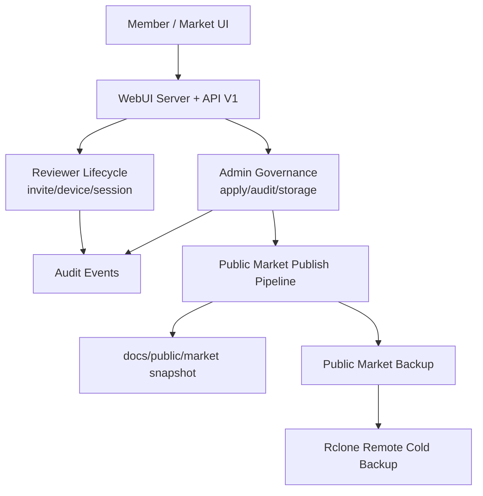

# Execution Direction Gap-Closure (v1.1)

## Problem Frame
Current delivery has reached a strong functional baseline: role-separated routes, reviewer lifecycle closure, user/market core workflows, storage backup APIs, and green test coverage (`360` collected tests). The remaining risk is no longer feature absence, but architectural drift and uneven hardening.

The current codebase has two dominant constraints:
- WebUI orchestration is concentrated in a large runtime file (`sharelife/webui/app.js`) with cross-domain coupling.
- Some roadmap-critical controls are only partially operationalized (owner-aware authorization consistency, device-granular reviewer sessions, storage encryption enforcement, and automated market publishing flow).

Without a focused v1.1 closure pass, additional features will increase maintenance load faster than capability value.

## Requirements

**Governance and Auth Hardening**
- R1. Enforce owner-aware authorization across all user mutation paths where resources carry `user_id` ownership metadata, with deterministic deny semantics for non-owners.
- R2. Replace reviewer global single-active session behavior with device-granular session invalidation while preserving admin revoke/reset control.
- R3. Keep admin/reviewer auth behavior deterministic: invalid/absent configured credentials must never grant access, and role-based capability checks remain server-enforced.

**WebUI Architecture and UX Consistency**
- R4. Split WebUI orchestration into bounded modules by domain (`member`, `market`, `reviewer`, `admin`, `storage`, `shared auth/i18n`) while preserving existing runtime IDs and capability map contracts.
- R5. Normalize button/color token usage in member and market surfaces to eliminate readability regressions caused by overlapping style overrides.
- R6. Keep `/member` and `/market` options parity strict (`install_options`, `upload_options`, `submit_options`), including upload-size guard behavior and i18n parity.
- R15. Keep the ordinary member surface physically minimal: `/member` may expose only member-safe navigation and must use explicit local-import wording for raw AstrBot migration; privileged console controls cannot remain in DOM as hidden artifacts.

**Market Publish and Distribution Pipeline**
- R7. Introduce an automated path from approved sanitized artifacts to public market entries/snapshot generation, instead of relying only on manual script invocation.
- R8. Ensure public-market backup sync remains scheduled and verifiable with auditable artifacts and manifest checksums.
- R9. Preserve strict boundary: only sanitized market artifacts are publishable/downloadable in public channels; auth secrets and operator materials remain excluded.

**Storage Cold-Backup Reliability**
- R10. Enforce `encryption_required` as an effective runtime gate when remote sync is enabled; non-compliant remote sync attempts must fail predictably.
- R11. Add concrete retention execution for remote artifacts (or an explicit managed policy adapter), not policy fields alone.
- R12. Keep restore lifecycle deterministic (`prepare -> commit|cancel`) with explicit validation evidence persisted and auditable.

**Docs and CI Contract Alignment**
- R13. Keep public docs interface-focused and private docs runbook-focused, with CI checks preventing sensitive SOP leakage into public surfaces.
- R14. Keep tri-lingual API and roadmap docs synchronized with actual route/method/error behavior for reviewer lifecycle and auth badges.

## Success Criteria
- Full test suite remains green, including WebUI E2E and reviewer lifecycle regression tests.
- Owner-aware enforcement tests exist for representative user mutation paths and fail correctly for non-owners.
- Reviewer multi-device sessions can coexist without unintended cross-device logout, while device revoke immediately invalidates only affected sessions.
- Public market publish flow can be executed end-to-end from approved sanitized artifact to downloadable catalog entry with checksum trace.
- Remote backup rejects encryption-noncompliant runs when `encryption_required=true` and records explicit failure reason.
- Public/private docs separation and tri-lingual route coverage pass CI checks.

## Scope Boundaries
- No introduction of a new runtime `Creator` login role.
- No immediate migration to external IdP (`OIDC/OAuth2`) in this closure pass.
- No full frontend framework rewrite; runtime IDs and existing test anchors remain stable.
- No exposure of private operator runbooks in public documentation.

## Key Decisions
- Decision: Treat v1.1 as a hardening and decomposition release, not a feature-expansion release.
- Rationale: Current risk profile is dominated by coupling and policy drift, not missing core endpoints.

- Decision: Prioritize owner-aware and reviewer session semantics before new role/features.
- Rationale: These directly affect authorization correctness and blast radius.

- Decision: Keep market publish and storage backup as auditable pipelines with deterministic artifacts.
- Rationale: Operational trust depends on reproducibility and post-failure diagnosability.

## Dependencies / Assumptions
- Existing route/capability contracts in `sharelife/interfaces/webui_server.py` remain backward-compatible during refactor.
- Existing scripts and workflows (`scripts/build_market_snapshot.py`, `scripts/publish_public_market_pack.py`, `.github/workflows/public-market-backup.yml`) are the baseline automation surfaces.
- Private docs stay outside public docs publishing roots.

## Outstanding Questions

### Resolve Before Planning
- None.

### Deferred to Planning
- [Affects R2][Technical] Define session storage model for device-granular reviewer tokens (in-memory map extension vs state-store persistence).
- [Affects R7][Technical] Decide whether publish automation is triggered inside admin decision flow or via post-approval job queue.
- [Affects R10][Needs research] Define enforceable crypt-remote detection strategy for `rclone` targets under current deployment constraints.
- [Affects R11][Technical] Choose remote retention implementation mode (native remote prune adapter vs manifest-index lifecycle manager).

## Next Steps
-> /prompts:ce-plan for structured implementation planning
